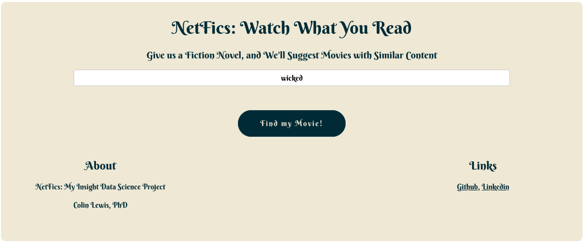
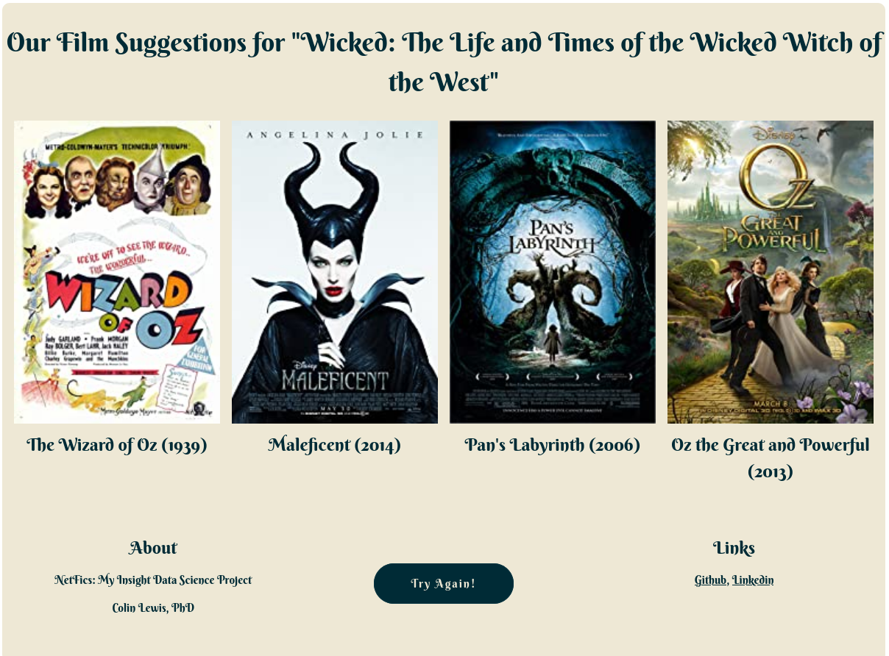

# [NetFics](http://datapredictions.online)
# Watch What You Read

## What is NetFics?
NetFics is a recommender that provides the user with curated film suggestions, based on an input book.

## How Does NetFics Work?
# First, you input the title of a book
</img>

# Then, you verify that the program has interpreted your book correctly
</img>

# Finally, enjoy your recommendations! 
</img>
